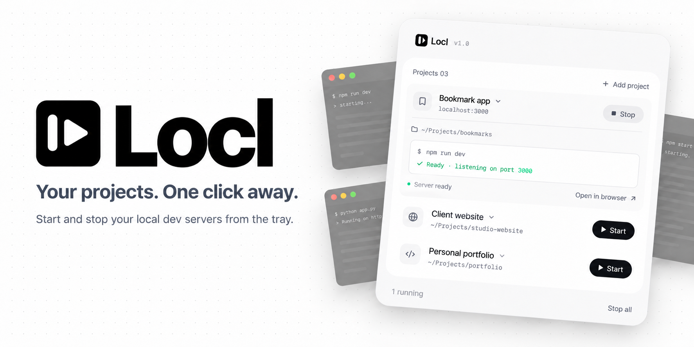

<p align="center">
  
</p>

# Locl

A tray app that starts and stops your local dev servers. No terminal hopping.

Import your project folders once. After that, starting a dev server is one
click. Locl runs the project's command, streams its output, picks the port out
of that output, and gives you a link to open it. Stopping kills the whole
process tree, so the port is actually free afterwards.

Each project has its own command, so it works with `npm run dev`, `pnpm dev`,
`cargo run`, `bun dev`, or anything else you'd type in a terminal.

## Install

Grab the installer from [Releases](../../releases), or build it yourself.

**Locl lives in your system tray, not the taskbar.** After installing, the
panel opens once so you know it worked. Close it and it parks in the tray
rather than quitting, because the servers it started need to keep running.

To get it back, click the Locl icon in the tray. Windows hides new tray icons
by default, so the first time you may need to click the `^` arrow next to the
clock and drag Locl out to pin it where you can see it.

Right-clicking the tray icon gives you Open, Stop all servers, and Quit.
Quitting stops every server Locl started.

## Build from source

Requires [Node](https://nodejs.org) and the [Rust toolchain](https://rustup.rs).
On Windows you also need the MSVC build tools and WebView2 (WebView2 ships with
Windows 11).

```bash
npm install
npm run tauri dev     # run it
npm run tauri build   # produce an installer
```

## Platform support

Built and tested on Windows 11. The process-tree kill uses `taskkill /T /F` on
Windows and falls back to `pkill` elsewhere; macOS and Linux should work but are
untested.

## License

MIT
